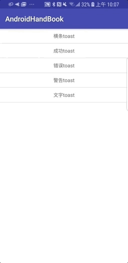

# AndroidHandBook :snail:
整理个人工作中用到的Android 通用功能

# 网络请求
Retrofit+okhttp+RX  
https://github.com/square/retrofit  
http://square.github.io/retrofit/  
## 使用步骤：
1. 集成
``` java
/**
 * retrofit2相关
 */
compile "io.reactivex.rxjava2:rxjava:2.1.13"
compile 'io.reactivex.rxjava2:rxandroid:2.0.2'
compile 'com.squareup.retrofit2:retrofit:2.4.0'
compile 'com.squareup.retrofit2:converter-gson:2.3.0'
compile 'com.squareup.retrofit2:adapter-rxjava2:2.3.0'
compile 'com.squareup.okhttp3:logging-interceptor:3.8.1'
/**
 * stetho 调试相关
 */
compile 'com.facebook.stetho:stetho:1.4.1'
compile 'com.facebook.stetho:stetho-urlconnection:1.4.1'
compile 'com.facebook.stetho:stetho-okhttp3:1.4.1'
``` 

2. 将api文件夹复制  


3. 参考下面例子进行网络请求
Json接口请求  


文件上传


# [Toast提示](https://github.com/fuhongliang/AndroidHandBook/tree/master/app/src/main/java/com/fuhl/androidhandbook/toast)
Toast分为五种类型
### 横条Toast、成功Toast、失败Toast、警告Toast、普通文本Toast  

      

可自定义高，只需要更换对应布局文件即可自定义想要的Toast效果
使用上也很方便  

``` java
 public void showSuccessToast() {
        ToastHelper.makeText("关注成功", Toast.LENGTH_SHORT,ToastHelper.SUCCESSWITHICONTOAST).show();
    }
 ``` 
 # Loading
  
 
 Loading的使用  
 LoadingDialog.show(this, "载入中...",0);

 # 消息对话框
  
 
 消息对话框的使用  
 ``` java 
 public void showMessageDialog(){
        MessageDialog.show(this,"消息提示框","你已报名成功了","知道了",new DialogInterface.OnClickListener(){
            @Override
            public void onClick(DialogInterface dialog, int which) {

            }
        });
    } 
    
 ```  
 
 # 输入对话框
  
 
 输入对话框的使用  
 ``` java 
 InputDialog.show(this, "验证", "请出入正确的用户名：", new InputDialog.InputDialogOkListener() {
            @Override
            public void onClick(Dialog dialog, String inputText) {
                dialog.dismiss();
            }
        });
 ```  
 
